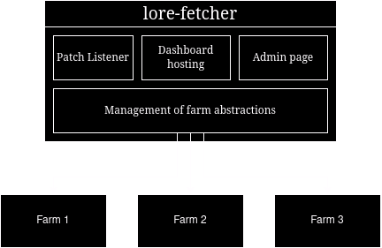
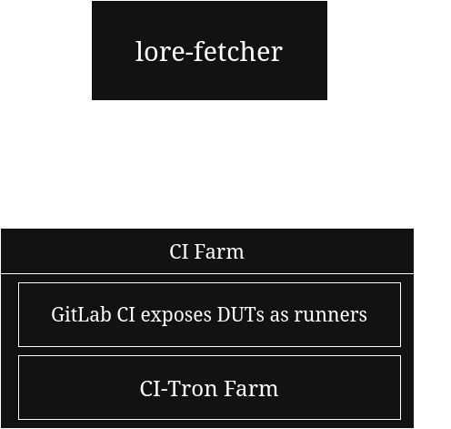

# lore-fetcher

## Introduction

A CI farm is a computer network where a designed node, usually known as a master or orchestrator, schedules CI jobs to the other connected devices,
which are known as Devices Under Testing (DUTs). This is a necessary solution for software projects that run at the kernel level, where the program to
be evaluated is a core component of the OS and must be tested by an external agent (i.e., another device or the host device if the DUT is a VM),
ensuring that the CI pipeline doesn't break if the program breaks.

The lore-fetcher project (lf) is born from the desire to manage CI farms for kernel development in a federated context. This means that lore-fetcher
aims to provide a system where multiple different CI farms can be integrated, and their resources can be managed as a unified source of DUTs.
The federated architecture of lf relies on the master node of the federation, the lf server itself. It is responsible for communicating with the
CI farms and managing them, while also providing extra features, such as:

+ Tracking new patches from mailing lists;
+ Exposing a dashboard with CI results from the federation's pipelines;
+ Enabling the allocation of unused CI resources to other CI tasks for the kernel community;
+ Analysis of unit test results.

<p align="center">
  
</p>

The CI farms are expected to communicate with the central node (the lore-fetcher server) via REST API. Each farm should be exposed to a CI
service such as Jenkins or GitLab CI. The lore-fetcher server then, is able to communicate with the CI services through their APIs, fetching
data on pipelines, runners, and jobs status to create an internal farm abstraction. With a farm abstraction, lf is able to store information and 
interact with its respective CI farm. 

Implementing farms and exposing them via a CI service can be done in multiple ways with multiple tools. Therefore, there is a standard that is
officially supported by the lore-fetcher project. The standard relies on farms implemented with [CI-Tron](https://gitlab.freedesktop.org/gfx-ci/ci-tron).
CI-Tron supports exposing the farm DUTs as project runners for a given CI repository. The lf server expects a GitLab project to be integrated into
it, so lf is then able to fetch its runners, pipeline, and jobs, in order to create its farm abstraction.

<p align="center">
  
</p>

## How to install

There is a very simple install script `install.sh` that compiles the Go source code and places it in `/usr/bin`.
Run it with 

```
    sudo ./install.sh
```

## How to start using

The core feature of `lore-fetcher` is its ability to track mailing lists. You can try it with the `--fetch` flag.


The `lore-fetcher --fetch` feature basically activates a daemon mode where `lore-fetcher` will be listening
to the given mailing list for new patches. Once it finds new patches, it can trigger a Jenkins pipeline.
The jenkins Pipeline must be configured with a `PATCH` parameter, so it can get the recent patch and start
a new build with it.

Notice it is also important to provide essential information, such as the mailing list to track. This can be done
with additional parameter flags.

```
lore-fetcher --fetch --mailing-list=all --fetch-interval=37
```

The command above will search for new patches from the `all` mailing list every 37 seconds. 

More details about `lore-fetcher`, its use cases, and proper configuration can be found in its documentation.

You can also try a basic Jenkins CI infrastructure integrated with `lore-fetcher` by running the `jenkins-sample` docker-compose
environment with a single `docker-compose up` command. Check `jenkins-sample/README.md` for more information about
how it is configured and how `lore-fetcher` is used to aid the automation of such infrastructure.

## The Jenkins sample

As mentioned above, there is a Jenkins `docker-compose` environment running a simple jenkins server environment
attached to a `lore-fetcher` instance, receiving new patches and testing a simple `tinyconfig` compilation.

Change to directory `jenkins-sample` and run `docker-compose up -d`, and it is as simple as that. There
will be a container running the `lore-fetcher` application and sending triggers to a Jenkins container.

You can access the Jenkins server Web GUI with any browser on `localhost:8080`, and log in with the 
`admin` user with password `admin`.
